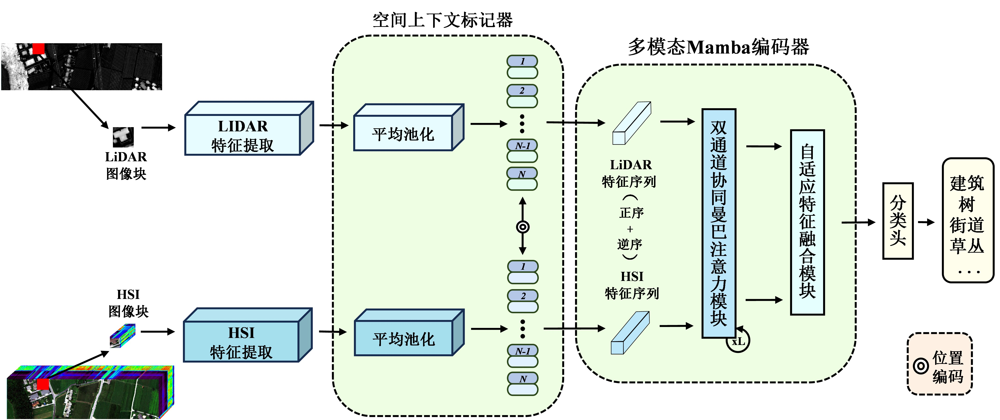

# AF-Mamba
## Adaptive fusion network for hyperspectral and LiDAR data collaborative classification based on Mamba

## 🧠 Introduction
<p align="center">
  
</p>

**AFMamba establishes a new paradigm for efficient and accurate fusion of HSI and LiDAR data by integrating Mamba’s linear-time modeling capability with parameter-shared cross-modal attention. The method effectively addresses the computational inefficiency of Transformers while achieving superior classification performance through adaptive feature fusion and global dependency learning. Future work will extend this framework to semisupervised scenarios and explore its applicability to other multimodal remote sensing tasks, such as change detection and target recognition.**

## 🛠️ Environment
```
pip3 install -r requirements.txt
```

## 🌟 Datasets
Get the disjoint dataset (Trento11x11 folder) from [Google Drive](https://drive.google.com/drive/folders/1HK3eL3loI4Wd-RFr1psLLmVLTVDLctGd?usp=sharing).

Get the disjoint dataset (Houston11x11 folder) from [Google Drive](https://drive.google.com/drive/folders/1OnLkDpqMtNJy0DRS6YsKKbSqQiiUSgro?usp=sharing)

Get the disjoint dataset (MUUFL11x11 folder) from [Google Drive](https://drive.google.com/drive/folders/1oTUAE3QiVb80sFNi6rvHukFTfZn-lJR_?usp=sharing)

## 📌 Structure

```
├── Data
│ └── <dataset_name>
│    └── ...
├── src
│ └── MMamba_Trento.ipynb  
│ ...
```

## 📄 Citation


```
@inproceedings{2026afmamba,
  title={AFMamba: Adaptive fusion network for hyperspectral and LiDAR data collaborative classification based on Mamba},
  author={Weng, Q and Chen, G W and Pan, Z Y and Lin, J W and Zheng, X T},
  journal={National Remote Sensing Bulletin},
  volume={30},
  number={2},
  pages={296--310},
  year={2026},
  doi={10.11834/jrs.20254539}
}
```
